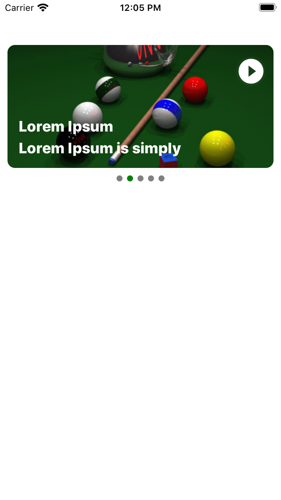

# React Native Banner View Component

A react native component for showing banner that automatically swipe.

## Getting Started

- [Demo](#demo)
- [Installation](#installation)
- [Supported versions](#supported-versions)
- [Usage](#usage)
- [Props](#props)
- [Methods](#methods)
- [Want to Contribute?](#want-to-contribute?)
- [Need Help?](#need-help?)
- [Collection of Components](#collection-of-components)
- [Changelog](#changelog)
- [License](#license)
- [Keywords](#keywords)

## Demo

[](https://github.com/weblineindia/React-Native-Banner-View/blob/master/BannerView.png)

## Installation

`$ npm install rn-weblineindia-banner-view --save`

## Supported versions

We have tested this component in ReactNative 0.60 - 0.62.5. You can still use it in other versions.

```javascript
import BannerView from 'rn-weblineindia-banner-view';

<BannerView
    data={this.state.data}
    titleKey="titleKey"
/>

```

## Props

| **Props**             | **Type**           | **Required**       | **Description**                                  |
|-----------------------|--------------------|--------------------|--------------------------------------------------|
| data                  | `array`            | yes                | Array List to be displayed                       |
| titleKey              | `string`           | no                 | Key which is used for title                      |
| subTitleKey           | `string`           | no                 | Key which is used for sub title                  |
| activeIndicatorColor  | `string`           | no                 | Color to be displayed for active page indicator  |
| passiveIndicatorColor | `string`           | no                 | Color to be displayed for passive page indicator |
| viewStyle             | `[object, array]`  | no                 | Styles is passed to the page view                |
| imageStyle            | `[object, array]`  | no                 | Styles is passed to the image                    |
| isAutoPlay            | `boolean`          | no                 | default true                                     |
| timeDuration          | `number`           | no                 | default 5 sec, For better result use max 3 sec   |
| onChangeIndex         | callback           | no                 | get index value of banner                        |

-----

## Methods

| **Method**           | **Description**                                                             |
|----------------------|-----------------------------------------------------------------------------|
| onChangeIndex        | Callback that is called when the banner index is changed.                   |

## Want to Contribute?

- Created something awesome, made this code better, added some functionality, or whatever (this is the hardest part).
- [Fork it](http://help.github.com/forking/).
- Create new branch to contribute your changes.
- Commit all your changes to your branch.
- Submit a [pull request](http://help.github.com/pull-requests/).

-----

## Need Help? 

We also provide a free, basic support for all users who want to use this ReactNative Banner View in their software project. In case you want to customize this Banner View to suit your development needs, then feel free to contact our [ReactNative developers](https://www.weblineindia.com/hire-react-native-developers.html).

-----

## Collection of Components

We have built many other components and free resources for software development in various programming languages. Kindly click here to view our [Free Resources for Software Development](https://www.weblineindia.com/software-development-resources.html).

------

## Changelog

Detailed changes for each release are documented in [CHANGELOG.md](./CHANGELOG.md).

## License

[MIT](LICENSE)

[mit]: https://github.com/weblineindia/React-Native-Banner-View/blob/master/LICENSE

### Keywords

 rn-weblineindia-banner-view, react-native-banner-view, banner-view, react-native, page-control
